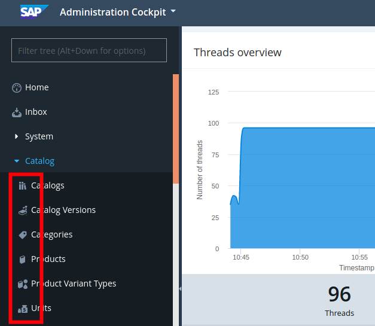

# SAP Commerce Cloud Backoffice icon converter

Simple Tool to create explorer tree icons for the SAP Commerce Backoffice
interface from simple icon files.

## Why is this needed?



The SAP Commerce Cloud Backoffice interface requires a special crafted sprite
image to show it as icon in the explorer tree. This tool helps creating this
sprites based on a simple icon file.


## How to use it?

The simplest case is to convert a single icon. For this you must have an input
icon meeting the following criterias:

 - Size is 16x16 pixels (given by SAP Commerce)
 - Transparent background (otherwise it will not really work)
 - File format should be "png"

Run the following commands to create the sprite (replace the example icon with
your own):

```sh
$ pip install sap-commerce-backoffice-icons
$ backofficeIconConverter exampleIcons/star.png
Process icon exampleIcons/star.png...
exampleIcons/star.png => exampleIcons/backoffice-star.png
```

That's it! Now you can use this icon sprite in your custom Backoffice extension
as icon for your custom types. For more help on how to do this, see
[Tutorial](doc/Tutorial.md).

You can also convert multiple icons:

```
$ backofficeIconConverter ~/FolderWithSomeIcons/* --output converted
```


## Install development environment

To install the script for development or to run it directly from source, the following
steps are needed:

 - Install Python >3.7
 - Install Poetry (see https://python-poetry.org/docs/)
 - Make the project ready to be used:
```sh
git clone https://github.com/dev-jan/sap-commerce-backoffice-icons.git
cd sap-commerce-backoffice-icons
poetry install
```
 - Run the script via Poetry virtual env:
```sh
poetry run backofficeIconConverter exampleIcons/star.png
```
